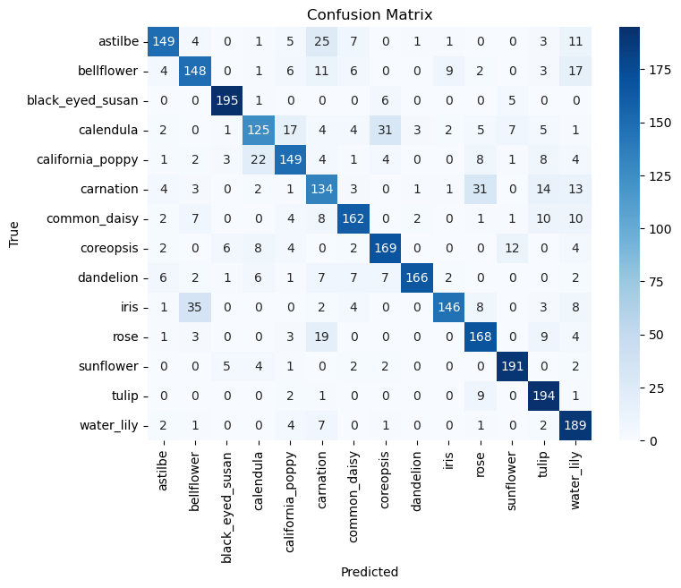

# Flower Classification (CNN)

**Authors**: Franko Ndou

## Overview

Welcome to the realm of BlossomTech, where innovation and nature converge. In this project, we are embarking on an exciting journey into the field of flower image classification with the power of Keras. Before we dive into the technical intricacies, it's essential to provide context. Imagine a world where the beauty and diversity of flowers have captivated humanity for centuries. Flowers hold a unique place in our lives, from cultural symbolism to scientific research and commercial applications. However, the process of accurately identifying and understanding different flower species has traditionally relied on manual expertise, often a time-consuming and challenging endeavor. In this project, we aim to revolutionize this age-old practice by automating flower identification. To fully appreciate the significance of our mission, let's begin by exploring the specific business challenges that fuel our journey.

## Business Problem

I was employed as a Data Scientist at "BlossomTech," a cutting-edge technology company specializing in AI and computer vision solutions. BlossomTech has recognized the growing demand for automated flower identification in various industries, including agriculture, horticulture, and e-commerce. My role as a Data Scientist is to develop a flower image classification model to address the following business challenges:

* Efficient Flower Identification: BlossomTech aims to provide a fast and accurate solution for flower identification, as traditional methods can be time-consuming and error-prone. Developing an image classification model will enhance efficiency and productivity in various sectors.
<br>

* Botanical Research Support: Botanists and researchers often need to identify and categorize different flower species for their studies. BlossomTech's model can support botanical research by providing a reliable tool for flower recognition.
<br>

* E-commerce Enhancement: BlossomShop, an e-commerce platform owned by BlossomTech, wants to integrate flower recognition technology into its mobile app. This will enable users to quickly identify and purchase flowers they encounter in their daily lives, enhancing the shopping experience.
<br>

* Gardening Assistance: BlossomGarden, a subsidiary of BlossomTech, offers gardening apps to help gardening enthusiasts. The image classification model can be integrated into these apps, allowing users to identify and learn about the flowers they encounter in their gardens.
<br>

* Educational Resources: BlossomTech aims to collaborate with educational institutions to provide a valuable educational tool for students studying botany and horticulture. The model can help students learn about different flower species and their unique characteristics.

Addressing these business challenges will not only establish BlossomTech as a leader in the field of flower recognition technology but also create new opportunities for growth and innovation in various industries. As the Data Scientist leading this project, your goal is to develop a highly accurate and efficient flower image classification model using Keras, providing a comprehensive solution to these business needs.

## Data

For this project, we will use the "Flower Classification" dataset, which is available on Kaggle. The dataset consists of a diverse collection of flower images belonging to various species. Each image is labeled with the corresponding flower species, making it suitable for supervised machine learning. The dataset contains a sufficient number of images for training, validation, and testing purposes.

You can access the dataset on Kaggle using the following link: [Flower Classification Dataset](https://www.kaggle.com/datasets/marquis03/flower-classification)

This dataset will serve as the foundation for training and evaluating our Keras-based flower image classification model.


## Methods

I developed a CNN model for image classification. I prepared the data, augmenting the training set to improve model performance and adjusting CSV files to match the updated dataset structure. My CNN architecture included convolutional, pooling, and dropout layers to capture features and reduce overfitting. I used class weighting to address slight class imbalances. For model optimization, I implemented hyperparameter tuning with Keras Tuner and callbacks like EarlyStopping. Finally, I adopted transfer learning with the VGG16 model, fine-tuning the last few layers to significantly boost accuracy, resulting in a robust classifier for my image dataset.

## Baseline Models

### Pre-Augmentation

Initially we were having terrible accuracy and loss. However after performing some data augmentation we were able to improve scores significantly.

We were getting scores of 59% test accuracy, with extreme overfitting and massive plateaus. 
<br>


<br>

Our Confusion Matrix was all over the place. Clearly theres more we can do within our pre-processing. This is horrendous even for a baseline


<br>

Our accuracy was sky-rocketing with the test scores plateauing, which is a telltale sign of overfitting. Thats why augmenting our data was able to improve the model significantly. It allows the model to generalize on the images and patterns more efficiently

<br>

We see a similar trend within the loss. The val loss was actually getting worse the more it ran with the train loss getting better and better. Another sign of overfitting

### Post-Augmentation

However after performing some simple data augmentation
```
train_datagen = ImageDataGenerator(
    rescale=1.0/255.0,
    rotation_range=20,
    width_shift_range=0.2,
    height_shift_range=0.2,
    shear_range=0.2,
    zoom_range=0.2,
    horizontal_flip=True,
    fill_mode='nearest'
)
```

We were able to improve our scores significantly from 59% to 76.7% accuracy


<br>

<br>

<br>

The Accuracy and Loss improved significantly from this, there was also a massive reduction in overfitting


## Trained Models

I Decided to train my baseline model as well as a VGG-16 model. I used Keras-Tuner to tune and find the best hyperparameters for both

###  My Model Architecture
```
_________________________________________________________________
Layer (type)                 Output Shape              Param #   
=================================================================
conv2d (Conv2D)              (None, 126, 126, 32)      896       
_________________________________________________________________
max_pooling2d (MaxPooling2D) (None, 63, 63, 32)        0         
_________________________________________________________________
batch_normalization (BatchNo (None, 63, 63, 32)        128       
_________________________________________________________________
conv2d_1 (Conv2D)            (None, 61, 61, 64)        18496     
_________________________________________________________________
max_pooling2d_1 (MaxPooling2 (None, 30, 30, 64)        0         
_________________________________________________________________
batch_normalization_1 (Batch (None, 30, 30, 64)        256       
_________________________________________________________________
conv2d_2 (Conv2D)            (None, 28, 28, 32)        18464     
_________________________________________________________________
max_pooling2d_2 (MaxPooling2 (None, 14, 14, 32)        0         
_________________________________________________________________
batch_normalization_2 (Batch (None, 14, 14, 32)        128       
_________________________________________________________________
flatten (Flatten)            (None, 6272)              0         
_________________________________________________________________
dense (Dense)                (None, 256)               1605888   
_________________________________________________________________
dropout (Dropout)            (None, 256)               0         
_________________________________________________________________
dense_1 (Dense)              (None, 14)                3598      
=================================================================
Total params: 1,647,854
Trainable params: 1,647,598
Non-trainable params: 256
_________________________________________________________________
```

### VGG-16 Architecture


### My Model Performance


<br>

<br>

<br>
```
46/46 [==============================] - 3s 59ms/step - loss: 0.6779 - accuracy: 0.7885
Test Loss: 0.6778632402420044
Test Accuracy: 0.7884747982025146
```
### VGG-16 Model Performance


<br>

<br>

<br>
```
46/46 [==============================] - 47s 1s/step - loss: 0.2961 - accuracy: 0.9310
Test Loss: 0.29609110951423645
Test Accuracy: 0.9309868812561035
```

## VGG-16 

### What is VGG-16?
VGG16 is a convolutional neural network model known for its simplicity and depth. Developed by the Visual Graphics Group at Oxford (hence "VGG"), it was a breakthrough model in deep learning for image recognition tasks. The "16" refers to the number of layers with weights in the network. VGG16 is particularly noted for its use of 3x3 convolutional layers stacked on top of each other in increasing depth, which allows it to learn more complex features at each level. It achieved high accuracy in the ImageNet challenge, a prestigious competition in image classification and recognition. Due to its effectiveness and straightforward architecture, VGG16 is widely used as a starting point for image recognition and classification tasks, and as a benchmark for many computer vision problems.

### How can this improve my model performance?

The deep architecture of VGG16, trained on the extensive ImageNet dataset, has learned to recognize a wide array of features. This pre-training means that my model doesn't need to learn these features from scratch; it can already detect general features that are applicable to my specific image classification task.

When I implement transfer learning with VGG16, I am taking advantage of its robust feature extraction capabilities. It saves me computational time and resources because I'm fine-tuning a pre-existing, well-optimized network rather than training a new one from the ground up. This also usually leads to a boost in accuracy since VGG16's layers have been optimized to capture a broad range of features that my model can refine further.

### Recommendations
* Enhanced Product Offerings for BlossomShop: Integrate the flower recognition technology into BlossomShop's mobile app. This feature will enable users to snap a picture of any flower and receive immediate information, including care instructions, availability on BlossomShop, and purchasing options. This not only improves customer engagement but also potentially increases sales.
<br>

 * Gardening App Integration: Implement the model into BlossomGarden’s apps, providing gardeners with instant flower identification and care tips. This feature can enhance user experience and potentially attract new customers to BlossomTech’s gardening solutions.
<br>

 * Customized Marketing Strategies: Analyze the user interaction data with the flower recognition feature to understand customer preferences and behaviors. This information can be used to tailor marketing campaigns, recommend products, and create more personalized shopping experiences on BlossomShop.
<br>

 * Licensing the Technology: Consider licensing your model to other companies in related fields, such as florists, landscaping firms, and botanical gardens. This can be an additional revenue stream for BlossomTech.


### Next Steps

* Model Complexity: Explore more complex architectures or ensemble models for accuracy improvements.
<br>

* Custom Loss Functions: Tailor loss functions to address specific aspects like reducing classification errors in certain flower categories.
<br>

* Expanded Training: Utilize additional data sources or cloud-based resources for further model training and refinement.
  

## For More Information

Please review the full analysis in [my Jupyter Notebook](./code/Flower-Image-Classification.ipynb) or my [presentation](./BlossomTech-Presentation.pdf).

For any additional questions, please contact me:

**Franko Ndou & frankondou@gmail.com**

## Repository Structure

Describe the structure of your repository and its contents, for example:

```
├── code
│   └── Flower Image Classification.ipynb
│   └── models
├── images
├── Data
│   └── train
│   └── val
├── README.md
├── .gitignore
└── BlossomTech Presentation.pdf
```